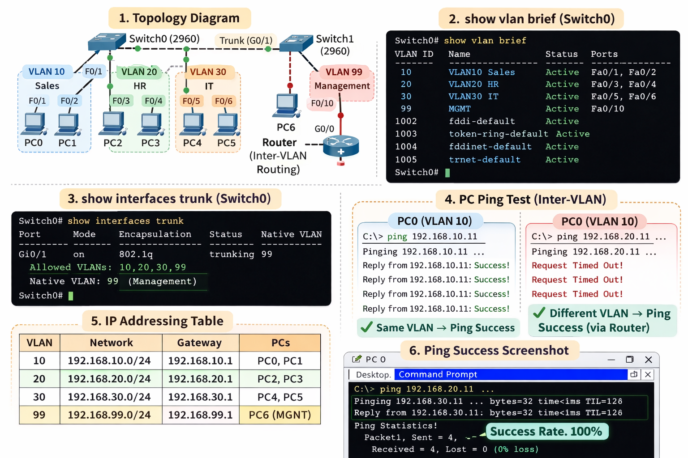
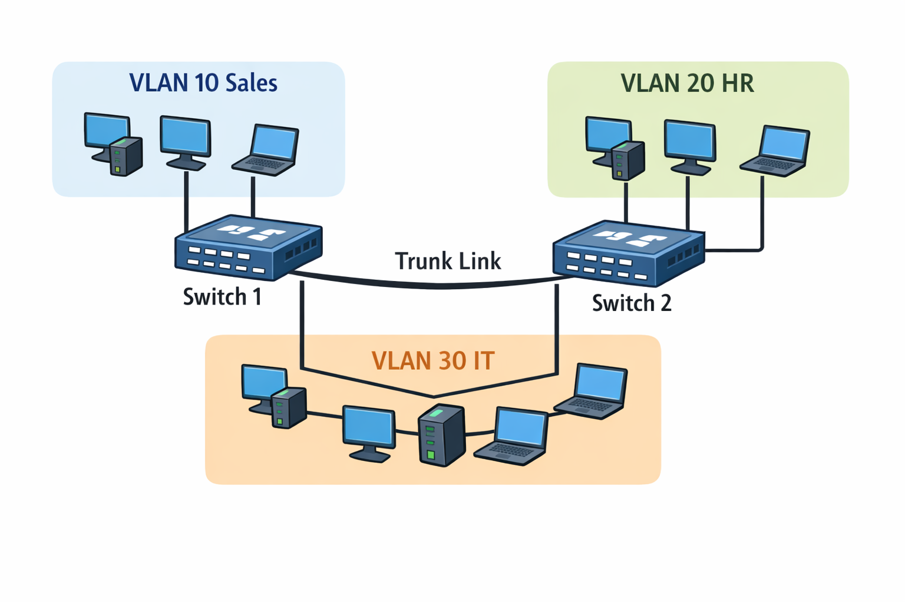

# VLAN Configuration (Cisco Packet Tracer)

This project demonstrates VLAN segmentation and inter-device communication using Cisco switches (and router/L3 switch if used) in Cisco Packet Tracer.

## Files
- **VLAN Configure.pkt** → Cisco Packet Tracer project file
- **/screenshots/** → topology and verification outputs
- **/docs/** → VLAN table, IP plan, verification, troubleshooting

## Project Objectives
- Create VLANs and assign access ports
- Configure trunk links between switches
- Verify VLAN separation and connectivity
- (Optional) Enable inter-VLAN routing (Router-on-a-Stick / L3 Switch)

## Topology Overview


## VLAN Plan
| VLAN ID | VLAN Name | Department/Use | Subnet (if used) |
|--------:|----------|----------------|------------------|
| 10 | VLAN10 | Sales | 192.168.10.0/24 |
| 20 | VLAN20 | HR | 192.168.20.0/24 |
| 30 | VLAN30 | IT | 192.168.30.0/24 |
| 99 | MGMT | Management | 192.168.99.0/24 |

## Key Configurations (Example Commands)

### Create VLANs (Switch)
```bash
enable
configure terminal
vlan 10
 name VLAN10
vlan 20
 name VLAN20
vlan 30
 name VLAN30
exit
write memory
```

### Access Port Assignment (Switch)
```bash
interface range fastEthernet 0/1-5
 switchport mode access
 switchport access vlan 10

interface range fastEthernet 0/6-10
 switchport mode access
 switchport access vlan 20

interface range fastEthernet 0/11-15
 switchport mode access
 switchport access vlan 30
```

### Trunk Configuration (Between Switches)
```bash
interface gigabitEthernet 0/1
 switchport mode trunk
 switchport trunk allowed vlan 10,20,30,99
```

## Verification (Must Show)
### On Switch
```bash
show vlan brief
show interfaces trunk
show running-config
```

Add screenshots:
- `show vlan brief` → `screenshots/show-vlan-brief.png`
- `show interfaces trunk` → `screenshots/show-trunk.png`

## Testing
- Ping within same VLAN should work
- Ping across different VLANs should fail **unless inter-VLAN routing is configured**
Add ping screenshots:


## Troubleshooting
Common checks:
- Trunk allowed VLAN list
- Access ports assigned to correct VLAN
- Native VLAN mismatch (if applicable)
- IP addressing and gateway settings

## Author
**Saimoon Islam**
Cisco Packet Tracer VLAN Lab
